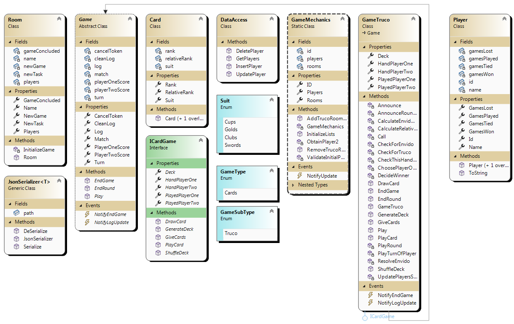

# Delmar.Jeronimo.SegundoParcial

---

### Title: *"Simple Truco"*

---

* Resume:

The program consists in a multi-thread app which can create multiple, virtually unlimited, rooms where 2 "bots" plays Truco against each other using a very simplistic version of the card game *Truco*.
When the game starts it tries to connect to the Data Base and load all the players there to the game, and then automatically creates 1 room where 2 bots are chosen to play against each other, in a way to show what the program is about.
When one presses double-click on the room, a new form opens and allows the user to see what's going on inside of the room. - The form can be moved around the screen without affecting the game and can be even closed without this stopping the game inside of the room.

Games are set to 4 rounds, each of which consists of 3 hands or less, depending on if someone wins the round before reaching the 3rd hand or not.

All games can be closed either from "outside", at the Lobby, or from "inside" at the **view form**.
Once a game finishes, the visual representation of the room at the Lobby changes to reflect this, same as the name of the room and the title of the view form. - A timer of 120 seconds long starts then, allowing the user to explore the events of the game in the text box if they want, then without mattering if the view form is opened or closed, the same is disposed and the game removed from the list of active games, putting it apart for the GC to take care of it.

The very moment the game finishes, it updates the statistics of the players and then tries to update them at the Data Base.

The user can opt for creating any number of new players, which are immediately uploaded to the Data Base the very moment they are created, and in the same way they can delete any player.

* RULES:

The rules used in this version of Truco are utterly basic.
The players can call both Envido and Truco at any point, but they can't call Truco if Envido hasn't been called previously.
They may call things and play cards unintelligently, simply based on chances, so there are no smart moves at all. - Answers to the calls are also random.
At the very bottom of all this, there's no even any kind of individuality for the "players", since they are anything but names. Everything is just a set of methods and variables.

If Envido is called and not wanted, the caller earns 1 point. If Truco is called and not wanted, the caller earns 1 point and the round ends with the caller standing as the winner of that round.
If Envido is wanted, then the points of the hands of the players is compared and the winner gets the point. - If the round ends and Truco has been called and wanted at some point, the winner of the round earns 2 points.
If nothing is called at any stance of the game, the player that wins 2 hands out of 3 earns the point of the round.

---

## **CLASS DIAGRAM**

---

* Subjects and their use:

### SQL

It's used to read data from the Data Base and write data on the Data Base, specifically related to Players.
At the beginning of the application the same creates an instance of the Data Access class to read all the players from the Data Base, and then it's used again every time any operation of writing or reading data to or from the Data Base is performed.

### EXCEPTIONS

It's lightly used in the program, given the fact that most methods are fail-proof in the tightly controlled and unflexible data environment.
This becomes handy, anyway, when some aspects are impossible to be accurately forseen and controlled, like when then program needs to contact the Data Base, or when it needs to make use of some file which its existence is not granted.
If by any chance these methods happen to fail, they will throw an exception which will cause a message box to promp and warn the user about the situation.
This subject is therefore used in 2 classes: Data Access (used for SQL querys) and Data Serialization (for serializing and deserializing data to and from files).

### GENERICS

This subject is actively used and actually a core aspect of the serialization and deserialization of data.
Although the game makes no use of it for anything other than cards, for when it has to make a new deck for a new game, the whole class is prepared for interacting with any kind of data, which it can serialize down to a file or deserialize back from a file to data.

NOTE: ... and although I didn't use this any further in this TP, in the moments of boredom when I switched to personal projects I made a wide use of this.
This is just a color note here; I wanted to thank you for this.

### SERIALIZATION AND FILE WRITING

Although these are 2 different subjects and processes, in my case they are used together in a same method. - When I need to write data down, the data is serialized to a formatted string of text, and then it's written down in the same method to the file I need to write. Then, in a different method for when I need to a load a file, I first read the file and then I deserialize it back to data.
This works together with **Generics**, as I said before. Even if I don't make a real use of Generics, the potential for writing any kind of data if I truly wanted (Players, single cards, or text from the logs) is there.

### INTERFACES

This is a rather controvertial subject in my program. - Based on the previous experiences and reviews, where I was said that my program lacked of flexibility and possibilities for an expansion in a future, I wrote this program thinking from the start in the possibility of a future expansion.
For this I made "Game" as an abstract class. Every room contains a game, but not every game is the same. But every game shares some basic, raw concepts with every other possible game.
Since C# doesn't allow multi-inheritance, I created then interfaces for Cards and Dices games; may the need ever arise for expanding the program in those directions, the implementation of such kind of games would be smooth, and wouldn't require any rewriting of the core aspects of the program. - For Cards, again, I created a single kind of Interface, which is Truco.

So my class GameTruco inherits from Game and ICard. It has the basic aspects of a game (a start and an end) and the basic aspects of a card game (shuffle a deck, get cards, play cards, return cards to the deck, etc.).

If I ever happen to make other games, I could either group them by their interfaces, or modify them by modifying something in their interfaces, and this wouldn't affect all games but just those that would inherit from those particular interfaces.

The usefulness of the subject here, then, is debatable.

### DELEGATES

They are used for storing methods of the interface and then using them in the Class Library at some specifict points, generally related to the prompting of message boxes or performing changes on controls nested in the forms.
Another use of delegates (an use I had to do because there's no other way) is for when a control is affected from a thread different to which the control has been created on; there I need to execute an invokation inside of which I need to declare a delegate with the piece of code I need to execute.

### TASKS

The very 1st half of the core of the program.
Every room in this program is an object, which contains a game. I made that clear before. - Inside of the room, the very moment the room is instanced, the constructor defines a task which is launched right away and contains the method 'Play' of whatever game the room has instanced inside. So the moment a room is created, the game inside is started to be played. A thread for every room.

Given the fact that this is one of the first aspects of the program I tackled, and given I did it by my own, the implementation of this subject differs from the cathedra. I don't start the task with a Canellation Token, but the Cancellation Token is **inside** the room as a property, and I can access it from outside through a method.
So if I ever need to stop the program, I just run the method of the particular room, and the game stops.

### EVENTS

Another early-tackled subject, this is the 2nd half of the core of the program.
The approach has 2 examples here. The first, quite simple, is a notification of changes whenever something is added to the game's log. This is heard by a method of the view form designated to watch that specific game, which in turn refreshes the text box that acts as a monitor for the game.
The second approach is more intrincate, and happens when the game finishes, wich fires an event that tells the view form to start the countdown. When the countdown. This is heard at the Lobby too, at which the visual representation of the room in the tree view changes to show the state of the game.
When the countdown finishes, **the form unsubscribes itself from the game**, and then proceeds to close itself from the thread the game is in.

### UNIT TESTING

There's not much of this in the program. There's only 1 unit testing.

---
---

### ADVANTAGES AND DISADVANTAGES OF MY PROGRAM

### **Advantages**

It's flexible, dynamic, and easy to use.
The game can be easily expanded for any other game.
If the user double-clicks on the players either on the players list (both in the Lobby and the view form) or the nodes representing them, the user may see a message with the statistics of the clicked player.
The program has only 2 important forms, and the rest of the forms are transitory.

### **Disadvantages**

I totally forgot about the history of games and matches, so that feature doesn't exist at all. The statistics is just a datagrid showing all the players with their played, won, lost, and tied games. There's no record of the matches.
The graphic part of the game sucks. Most of the time spent was focused on the proper functionality of the program. - The game logic took 1 day alone, and although it has been one of the easiest parts to develop, it's a labyrinth of interconected methods, some of which are there only to cut a bigger method down into specific and more simple bits.

Given all this, the graphic side suffered horribly, reduced to just 5 hours of development. - Plans for a graphic implementation of the cards were scrapped, same as allowing the user to play the game.

---

### Final Notes and Thoughts:

* I must admit that I still don't understand well the concept of testing. While I get the mechanics of testing, I can't figure the need for testing something, or get why I would ever test some method, for which purpose.
This goes indoubtedly glued to the fact that I try to generate code that's the most fail-proof possible, as I used to do in C; if there's a chance for my code to crash, I feel the need to foresee it and prevent that from happening.
I tried to change this set of mind during this TP, but I couldn't. I understand the mechanics of testing, but the whole majority of my code is not easy to test and I probably couldn't think of a situation for my code to fail, or a reason for making it fail.

* I use to work on projects for my own when I'm bored. This time I took this semester with calm, trying not to hurry (too much). So I didn't experiment as much as I did in the previous semester, and I didn't investigate ahead of the class. Therefore, I enjoyed it. May I pass or not, it was a nice experience.

* Some parts of the code I developed here I used it for my own projects. Opposite to what happened with the 1st TP, this one didn't nourish from my own projects as much as my projects nourished from the code written here.

* The program is not written based on the MVP model only because I was already by the 50% of it when that model whas shown in class. Shame on me :(

